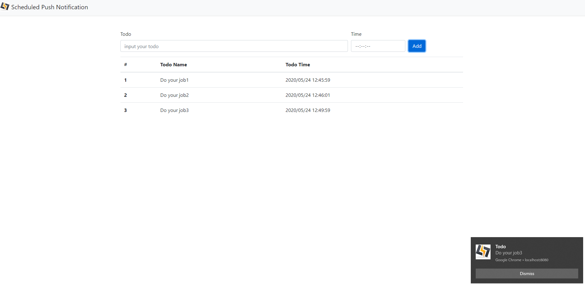

# try-scheduled-push

[](https://travis-ci.org/thundermiracle/try-scheduled-push)

A try of Push Notification's experimental function -- Scheduled Trigger.

## Screenshot



## Requirements

1. 現時点（2020.05.22）試験運用版なので、chromeで下記の機能を有効にする必要がある。

    [chrome://flags/](chrome://flags/) で `#enable-experimental-web-platform-features` を有効へ

1. httpsで動かす

    設定手順：[https://thundermiracle.com/blog/2020-05-23-windows-localhost-https/](https://thundermiracle.com/blog/2020-05-23-windows-localhost-https/)

## Startup

```shell
npm install
npm start
```

## Access

[https://localhost:8080](https://localhost:8080)にアクセスしてみてください。
